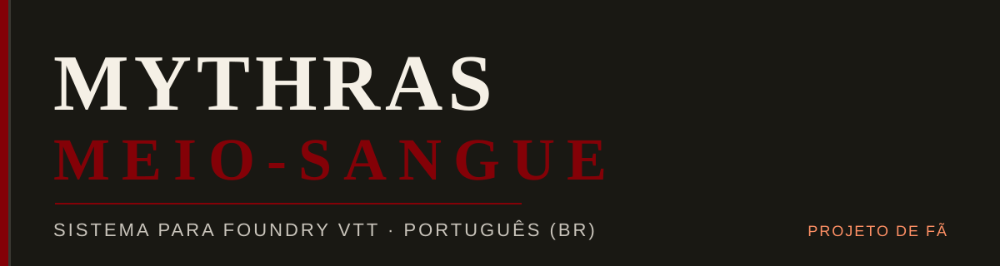
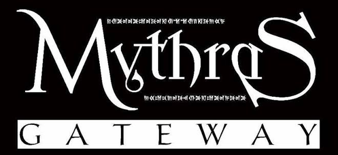

<div align="center">




# Mythras: Meio-Sangue 🗡️

**Adaptação em português brasileiro do sistema Mythras para Foundry VTT.**
Projeto de fã, não oficial. Fork do [Foundry VTT Mythras](https://gitlab.com/kp-systems/mythras) (kp-systems, licença MIT).

[🇧🇷 Português](#-português) · [🇺🇸 English](#-english)

</div>

---

## 🇧🇷 Português

### O que é

**Mythras: Meio-Sangue** é o sistema [Mythras](http://thedesignmechanism.com) rodando no [Foundry Virtual Tabletop](https://foundryvtt.com), traduzido e adaptado para o Brasil.

O trabalho original é de [kp-systems](https://gitlab.com/kp-systems/mythras) e colaboradores. Aqui ele fala português: tradução completa, e ajustes de regras e conteúdo pensados para o cenário **Meio-Sangue** e para a mesa brasileira.

### ⚠️ Aviso Legal

- Este é um **projeto de fã, não oficial**.
- **Não é afiliado, endossado ou patrocinado** pela The Design Mechanism ou pela equipe kp-systems.
- O sistema Mythras é propriedade de [The Design Mechanism](http://thedesignmechanism.com). Todos os direitos reservados aos respectivos detentores.
- Este projeto utiliza as regras do **Mythras Imperative**, disponíveis gratuitamente em [thedesignmechanism.com](http://thedesignmechanism.com), usadas conforme permissão.
- O código-fonte deste fork é distribuído sob a mesma [licença MIT](LICENSE) do projeto original.

### Instalação

No Foundry VTT, vá em **Configurações → Sistema → Instalar Sistema** e cole o link do manifest:

```
https://raw.githubusercontent.com/SoftMissT/Mythras-Meio-Sangue/main/system.json
```

Ou baixe o ZIP direto:

📦 **[Download — versão mais recente](https://github.com/SoftMissT/Mythras-Meio-Sangue/archive/refs/heads/main.zip)**

### Como Contribuir

O guia de configuração do ambiente de desenvolvimento está no [CONTRIBUTING.md](CONTRIBUTING.md). Issues e pull requests são bem-vindos.

### Créditos

**Projeto original — Foundry VTT Mythras:**
- [Jonathan Karkour](mailto:greshbolt@gmail.com) (Discord: Greshbolt#1682)
- [Tom Paoloni](mailto:tpaoloni@protonmail.com) (Discord: goog#9039)
- Todos os [contribuidores do projeto original](https://gitlab.com/kp-systems/mythras/-/graphs/master)

**Adaptação Meio-Sangue (PT-BR):**
- [SoftMissT](https://github.com/SoftMissT) — tradução, adaptação e manutenção

---

## 🇺🇸 English

### What is this project?

**Mythras: Meio-Sangue** is the [Mythras](http://thedesignmechanism.com) system running on [Foundry Virtual Tabletop](https://foundryvtt.com), translated and adapted for Brazil.

The original work belongs to [kp-systems](https://gitlab.com/kp-systems/mythras) and contributors. Here it speaks Portuguese: a full translation, plus rule and content adjustments made for the **Meio-Sangue** setting and Brazilian tables.

### ⚠️ Disclaimer

- This is an **unofficial fan project**.
- It is **not affiliated with, endorsed by, or sponsored** by The Design Mechanism or the kp-systems team.
- The Mythras system is the property of [The Design Mechanism](http://thedesignmechanism.com). All rights reserved to their respective holders.
- This project uses the **Mythras Imperative** rules, freely available at [thedesignmechanism.com](http://thedesignmechanism.com), used with permission.
- The source code of this fork is distributed under the same [MIT License](LICENSE) as the original project.

### Installation

In Foundry VTT, go to **Settings → System → Install System** and paste the manifest link:

```
https://raw.githubusercontent.com/SoftMissT/Mythras-Meio-Sangue/main/system.json
```

Or download the ZIP directly:

📦 **[Download — latest version](https://github.com/SoftMissT/Mythras-Meio-Sangue/archive/refs/heads/main.zip)**

### Contributing

See [CONTRIBUTING.md](CONTRIBUTING.md) for the development environment setup guide. Issues and pull requests are welcome.

### Credits

**Original project — Foundry VTT Mythras:**
- [Jonathan Karkour](mailto:greshbolt@gmail.com) (Discord: Greshbolt#1682)
- [Tom Paoloni](mailto:tpaoloni@protonmail.com) (Discord: goog#9039)
- All [original project contributors](https://gitlab.com/kp-systems/mythras/-/graphs/master)

**Meio-Sangue Adaptation (PT-BR):**
- [SoftMissT](https://github.com/SoftMissT) — translation, adaptation & maintenance

---

<div align="center">



*Mythras Gateway usado com permissão / used with permission*
*The Design Mechanism makes no representation or warranty as to the quality, viability, or suitability for purpose of this product.*

</div>
